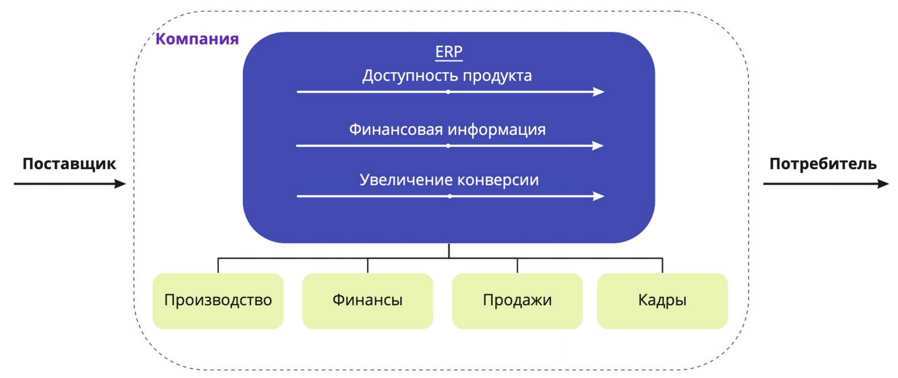
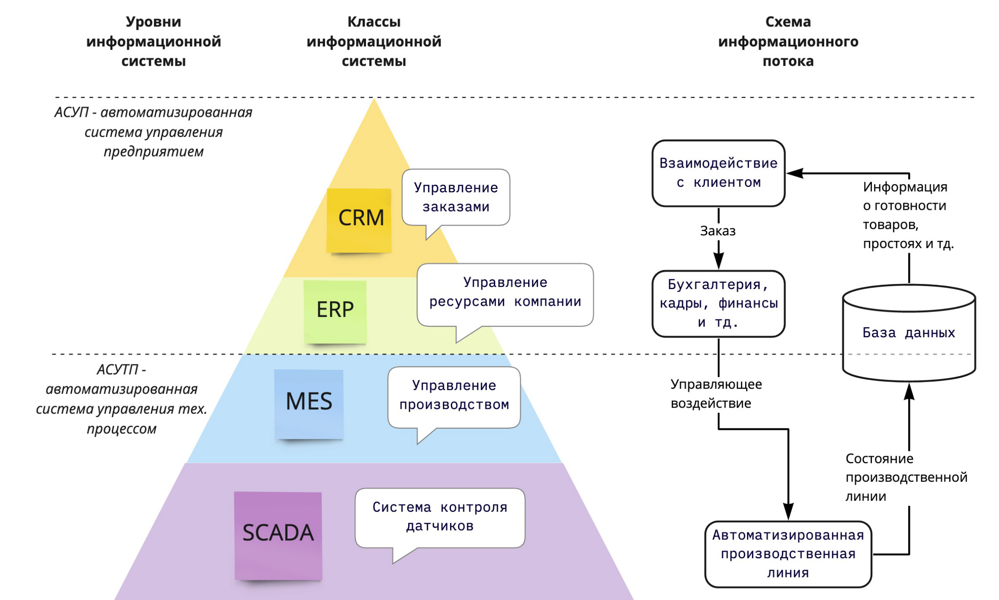

## Роль IT в разработке информационной системы компании

## Задачи информационной системы (ИС)

`Информационная система` — это комплекс программных и аппаратных средств, предназначенных для автоматизации процессов сбора, хранения, обработки и распространения информации в целях достижения конкретных бизнес-задач.

Научное сообщество выделяет две задачи, на решение которых нацелена применение информационных систем внутри компании.

* **Автоматизация**
  * Замещение ручного труда технологией.
  * Пример: Замена ручного бухгалтерского учета автоматизированной системой учета
  * Проблема: не является источником конкурентного преимущества
* **Процесс изменения структуры затрат**
  * Разработка информационных возможностей.
  * Важно, чтобы элементы цепочки создания ценности взаимодействовали друг с другом.
  * Подобная интеграция имеет решающее значение для предоставления нужной информации заинтересованным сторонам.

---

    Понимание бизнес-процессов при работе с информационной системой необходимо для эффективного управления взаимоотношениями с клиентами, повышения уровня удовлетворённости клиентов и увеличения прибыли. Это позволяет анализировать и совершенствовать процессы взаимодействия с клиентами, выявлять проблемные зоны и разрабатывать стратегии для их устранения. Также, применение информационных систем помогает определить требования заказчика, разработать стратегию развития компании, а также контролировать выполнение задач и достижение поставленных целей.

Подробнее вы можете почитать по ссылкам: 

* [процессный подход](https://bpmn2.ru/blog/processny-podxod-dlya-chainikov)
* [функциональный подход](https://rusconsult.ru/common/stati-nashih-ekspertov/business-processes/business-processes_820.html)
* [декомпозиция](https://silaunion.ru/articles/osnovy-dekompozicii-biznes-processov)

## Ценность ИС

* **Достоинства:** объединяет процессы и информационные потоки в рамках компании, стандартизация бизнес-процессов
* **Недостатки:** внедрение ИС требует значительной реорганизации и крупномасштабных изменений, значительные расходы в долгосрочной перспективе. Подробнее о кейсе про Amazon и Barnes&Noble.

## Пирамида автоматизации предприятия

